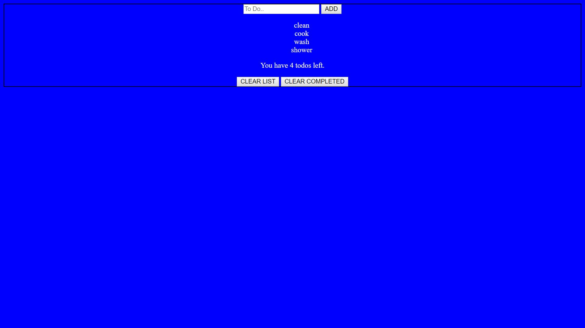

My Todo list

This is my personal To Do list that allows you to clear the entire list, mark items as completed, clear the completed items while still keeping the items up that need to be completed and even edit the spelling of a task if you spelled it incorrectly.

link to project:

How it's made:
Tech used:HTML, CSS, Javascript, Jquery

First I started off by figuring out how to add your tasks into a list. Once I figured out how to add tasks I wanted to inform the user how many tasks they have left I did that with the append method. After being able to add items to the list I had to figure out how to clear all of the items from the list. That left me with a basic todo list but I wanted
to more features so I also added the ability to click a task enter and edit it incase you typed something wrong and also the ability to move that individual task if you no longer need it.

Optimizations:
At first it was a basic todo list with the ability to add and remove tasks but I added the ability to edit and delete individual tasks. I would eventually like to make it look a notebook but haven't done so yet due to time being against me.

Lessons Learned:
I learned that app always have room to be optimized to add functionality or increase performance which happened alot with this project. I also learned how to inputs and print them into the DOM with this project being my first experience with that.
